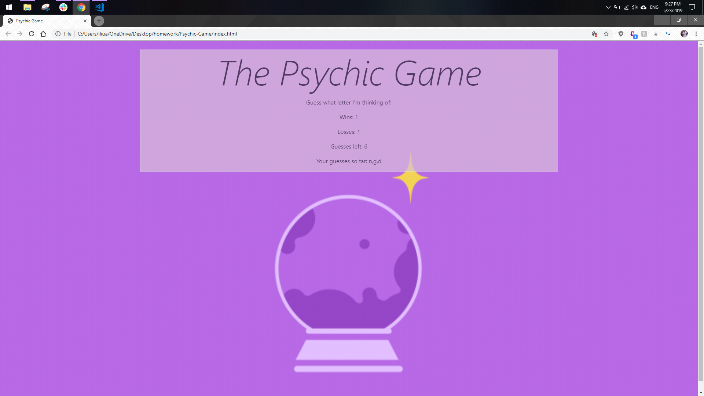

# Psychic-Game

## About ##
This is a game where the user has to press a letter on their keyboard to guess what the computer has randomly chosen. The user has 9 tries to guess the correct letter. With each guess, the guess count decreases by 1. When the guess count reaches 0, the lose score will increase by 1. If they guess the correct letter, the win score will increase by 1. The computer will then choose a new letter for the user to guess. The user's guesses will also be displayed on the screen until the game resets after 9 guesses. 

The game is built using HTML and Javascript. 

## Technology Used ## 
* HTML 
* Javascript
* CSS 
* Bootstrap

## Author ## 
Adrienne Liu

## Acknowledgement ##
[Khrystyna for Background Image](https://dribbble.com/shots/5467579-Magic-Crystal-Ball)